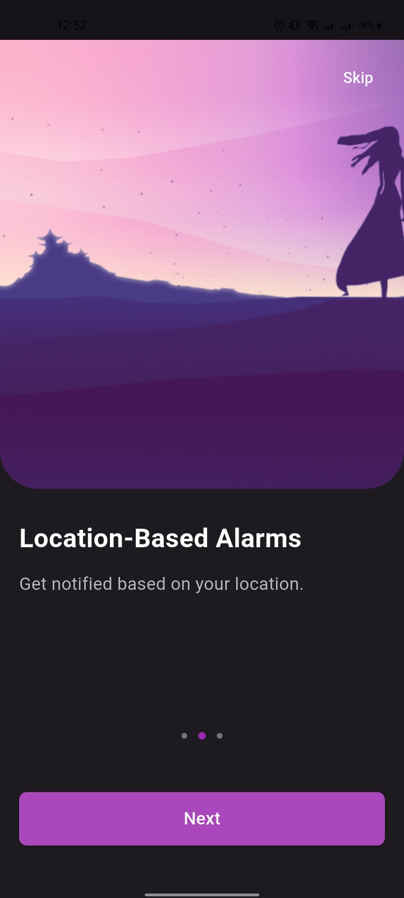
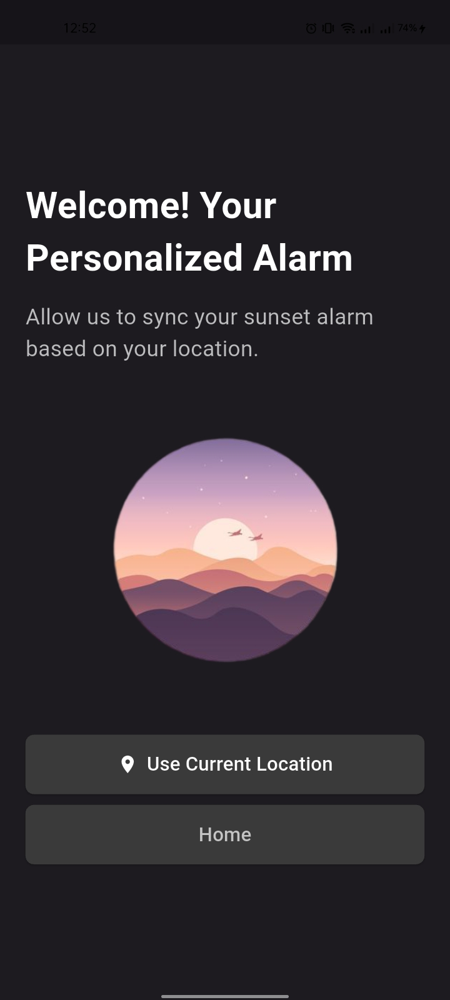
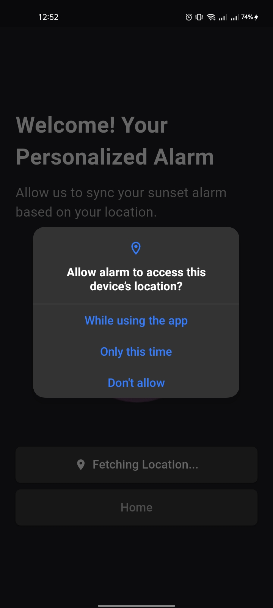
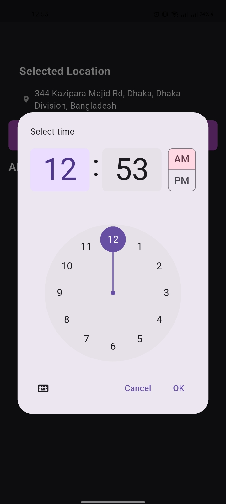
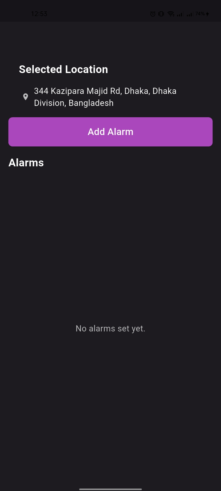
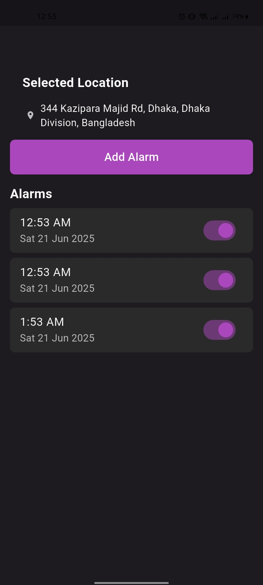

# ⏰ Alarm App – Flutter

A Flutter-based mobile alarm application with location detection and local notifications support. It allows users to:

- Set multiple alarms
- Enable/disable alarms
- Receive timely local notifications
- Automatically fetch and display current location address

## 📱 Features

- Local time-based alarm scheduling
- Persistent alarm storage using `shared_preferences`
- Geolocation with address resolution
- Local notification support (Android/iOS)
- Beautiful dark UI

---

## 🛠️ Tools & Packages Used

| Package Name               | Version     | Purpose                               |
|---------------------------|-------------|----------------------------------------|
| `geolocator`              | ^14.0.1     | For getting user's current GPS location |
| `geocoding`               | ^4.0.0      | Converts coordinates into readable address |
| `intl`                    | ^0.20.2     | Date formatting                         |
| `shared_preferences`      | ^2.0.15     | Store alarms persistently               |
| `flutter_local_notifications` | ^19.2.1 | Schedule and show local notifications  |
| `timezone`                | ^0.10.1     | Required for accurate scheduling        |
| `permission_handler`      | ^12.0.0+1   | Handle runtime permissions              |
| `cupertino_icons`         | ^1.0.8      | iOS-style icons                         |

---

## 🚀 Screenshots

### 🆕 Onboarding (Example)
  

### 📍 Location Detection
 

### 🏠 Home Screen
  

> _Note: Add these screenshots to a `/screenshots/` folder in your project repo._

---

## 🎬 Demo Video

Watch a working demo of the app here:  
📺 [Demo on Google Drive](https://drive.google.com/drive/folders/1F-Il_JmMCw4KTaSgyDxYPmN9sB2Tw8kg?usp=drive_link)

---

## 📦 Getting Started

```bash
git clone https://github.com/Mosaidur/alarm.git
cd alarm
flutter pub get
flutter run
